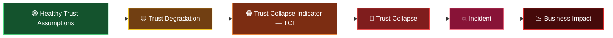
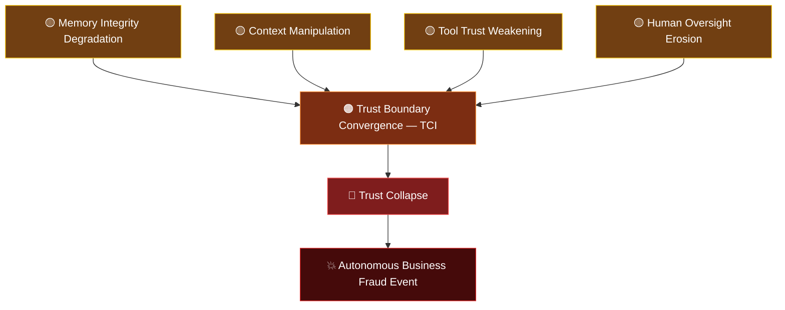

import Callout from '@/components/Callout.astro';
import ArchitectureNote2 from '@/components/ArchitectureNote2.astro';
import ArchitectureNote from '@/components/ArchitectureNote.astro';

<ArchitectureNote2 type="insight" title="Key Insight">
Traditional cybersecurity asks: **What attack happened?**

Agentic security increasingly needs to ask: **What trust relationship is beginning to collapse?**
</ArchitectureNote2>

## Trust Collapse Indicators (TCIs): Understanding Why Agentic Systems Fail When Trust Decays

As agentic AI systems become more autonomous, interconnected, and capable of acting on our behalf, security teams face a new challenge.

Traditional threat models explain how an attack occurred. They often fail to explain why the system ultimately failed.

In many agentic incidents, the root problem is not the attack itself. It is the weakening and eventual collapse of one or more trust relationships that the system depends upon.

This is where **Trust Collapse Indicators (TCIs)** become useful.

---

## The Existing Boxed Approach to Attack-Centric Thinking

Most security programs are organized around:

> **Threats => Vulnerabilities => Controls => Incidents**

<ArchitectureNote type="info" title="Agentic systems introduce">

      - Autonomous decision making
      - Tool execution
      - Persistent memory
      - Delegated authority
      - Multi-agent collaboration
      - Human approvals
      - Dynamic trust relationships
</ArchitectureNote>

The same attack technique can produce dramatically different outcomes.

### Example

<Callout type="danger" title=" Prompt Injection - may result in:">
 - Mission Overreach
 - Unauthorized Tool Execution
 - Delegated Authority Abuse
 - Human Approval Manipulation
</Callout>

The attack is identical.

**The outcome is different.**

> The missing variable is **trust**.

---

## The Real Problem: Trust Decays

Every agentic system is built upon layers of assumed and delegated trust.

<ArchitectureNote type="info" title="Trust Is Not Static">
      - User trusts Agent 
      - Agent trusts Context
      - Agent trusts Memory
      - Agent trusts Tools
      - Tools trust Credentials
      - Agents trust Other Agents
      - Humans trust Recommendations
</ArchitectureNote>

At deployment time, these assumptions may be valid.

**Over time, they decay.**

<ArchitectureNote2 type="warning" title="Trust Is Not Static">
Traditional systems often assume that trust is established during deployment and remains valid.

Agentic systems continuously create, inherit, delegate, extend, and consume trust.

The challenge is no longer only establishing trust. The challenge is recognizing when existing trust assumptions are no longer justified.
</ArchitectureNote2>

### Why Trust Decays

      - New tools are introduced
      - Permissions expand
      - Context changes
      - Business processes evolve
      - Additional agents are deployed
      - Human oversight weakens
      - Data quality degrades

       >     Trust rarely fails all at once.
       >
       >                 ⬇
       >
       >     Trust erodes.
       >
       >                 ⬇
       >                 
       >     Then trust collapses.

            
---

## Introducing Trust Collapse Indicators (TCIs)

A **Trust Collapse Indicator (TCI)** is an observable, forward-looking signal that a critical trust relationship is weakening, degrading, or becoming susceptible to failure.

> A TCI does not necessarily mean that an incident has already occurred.

Instead, it highlights that one or more trust assumptions are becoming increasingly unreliable and that intervention may be required before the system crosses into full trust collapse.

TCIs help answer:

      - Which trust assumption is degrading?
      - Why is that trust relationship becoming unstable?
      - What downstream relationships are now at risk?
      - What compound effects may emerge if the condition persists?
      - How can multiple trust weaknesses converge into a larger failure?

<Callout type="note" title="TCIs Are Leading Indicators">
         -   Vulnerabilities indicate what can be exploited.

         -   Threats indicate who or what may exploit them.

         -   **TCIs indicate which trust relationships are moving toward collapse, creating an opportunity to intervene before the outcome becomes an incident or material business impact.**
</Callout>

---

## What a Trust Collapse Indicator(TCI) Is Not

<Callout type="tip" title="Not a TCI">
 - Prompt Injection
 - Memory Poisoning
 - Malicious MCP Server
 - Credential Theft
</Callout>

These are attack techniques, threat events, or weaknesses.

<Callout type="Sol" title="Potential TCIs">
 - Mission Overreach
 - Delegated Trust Failure
 - Trust Boundary Breach
 - Authority Escalation
 - Trust Propagation Failure
 - Human Oversight Degradation
 - Trust Boundary Convergence
 - Cascading Trust Failure
</Callout>

---

## The Trust Lifecycle and the Intervention Window

<Callout type="warning" title="The Intervention Window">
The most valuable characteristic of a TCI is that it appears before trust has fully collapsed.

In the yellow and orange zones, organizations can still strengthen controls, reduce exposure, increase oversight, narrow authority, or re-establish trust relationships.

Once the system enters the red zone, recovery becomes significantly more expensive, disruptive, and uncertain.
</Callout>

> ### Traditional Thinking
> 
>      Prompt Injection
>
>            ⬇
>
>      Unauthorized Payment

<Callout type="Exe" title="TCI Thinking">
      Prompt Injection

           ⬇

      Mission Overreach

           ⬇

      Authority Escalation

           ⬇ 

      Delegated Trust Failure

           ⬇

      Unauthorized Payment
</Callout>

The attack initiates the event.

> The trust collapse explains the outcome with full context.

---

## Multi-Agent Systems Change Everything

Now make our situation more complex, bring more agents. Consider a simplified enterprise system with multi-agents:

>
>     Planner Agent
>      
>            ⬇
>
>      Research Agent
>
>            ⬇
>
>      Approval Agent
>
>            ⬇
>
>      Execution Agent
>
>            ⬇
>
>    Enterprise Systems

A traditional investigation often searches for the compromised component.

<Callout type="Exe" title="TCIs focus on the compromised and weakening trust relationships.">
      Compromised Research Output

                  ⬇

      Trust Propagation Failure

                  ⬇

      Agent Boundary Breach

                  ⬇

      Cascading Trust Failure

                  ⬇

      Incorrect Autonomous Decisions
</Callout>

**The individual agents may operate exactly as designed. The failure emerges from how trust is inherited and propagated across them.**

---

## Trust Boundary Convergence

One of the most dangerous patterns in agentic systems occurs when multiple weakened trust boundaries converge.

Think of this as the cybersecurity incident equivalent of side-effect of mixing medications.

A single issue may be manageable.

> Several interacting issues can produce an entirely different outcome.

<ArchitectureNote2 type="warning" title="Interaction Effects Matter">
Trust Boundary Convergence may become one of the most important TCIs in future multi-agent environments because the ultimate failure emerges from interaction effects, not from any individual weakness.
</ArchitectureNote2>

---

## Proposed TCI Categories
Here, we propose these below Six Categories towards the analytical and Observability layer;

**Boundaries >> Delegation >> Mission >> Oversight >> Runtime >> Emergent**

### 🛡️ Boundary Indicators

- Trust Boundary Breach
- Context Boundary Breach
- Memory Boundary Breach
- Tool Boundary Breach
- Agent Boundary Breach

### 🤝 Delegation Indicators

- Delegated Trust Failure
- Authority Escalation
- Trust Propagation Failure

### 🎯 Mission Indicators

- Goal Overreach
- Mission Overreach
- Objective Drift
- Autonomy Amplification

### 👁️ Oversight Indicators

- Human Oversight Degradation
- Approval Integrity Failure
- Accountability Breakdown

### 📡 Runtime Indicators

- Telemetry Blindness
- Control Evasion
- Runtime Policy Bypass

### 🕸️ Emergent System Indicators

- Trust Boundary Convergence
- Cascading Trust Failure
- Cross-Agent Trust Collapse
- Swarm Amplification

---

## How TCIs Could Change Security Practice

TCIs are not intended to replace existing threat models, control frameworks, or architecture methods.

> They add a new analytical & Observability layer that helps teams recognize when trust assumptions are becoming unsafe.

Potential applications include:

- Threat modeling
- Architecture reviews
- Runtime governance
- Risk assessments
- Multi-agent orchestration
- Human oversight programs
- Incident analysis
- Operational resilience

<Callout type="Exe" title="A future workflow may look like:">
      Threat

        ⬇

      Trust Collapse Indicators

        ⬇

      Incident Chains

        ⬇

      Controls and Interventions

        ⬇

      Architecture Improvements

        ⬇

      Business Resilience
</Callout>

<Callout type="note" title="Framework Neutral by Design">
TCIs are not tied to a specific framework, platform, architecture, or vendor.

Their value comes from illuminating weakening trust relationships before attacks or operational failures create significant consequences.
</Callout>

---

## Final Thoughts

Our industry has become increasingly effective at identifying threats and attacks.

The next challenge is understanding trust collapse.

Threats explain what might happen.

Incidents explain what did happen.

> **Trust Collapse Indicators help explain what is beginning to happen.**

As agentic systems grow in autonomy, scale, and complexity, the ability to identify weakening trust relationships before they collapse may become one of the most important capabilities in agentic security.

<Callout type="Sol" title="">
> Not simply **What attack occurred?**
>
> But rather:

 **What trust relationship is beginning to collapse, and can we intervene before it reaches the red zone?**
</Callout>